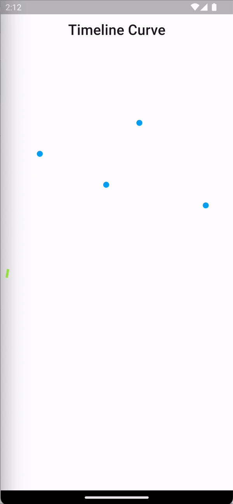

## Time Line Curve
## Working Example 

Timeline Curve Flutter

Developed a flutter application in which the dynamic Data plotting on the canvas and making the timeline curve with animation. 

State Management - 
Implemented Bloc Architecture in an entire flutter application for smooth and better Architecture.

Custom Painter- 
Created a custom painter functionality in which i have implemented a cartesian plane in background for plotting the timeline onto the canvas.
X-axis contains the weekdays and the Y-axis contains the Time. 
Plotted the points on the canvas according to the dynamic data and joins the points to make a smooth timeline curve with animation loaded. 
Added a Timeline view box on click of plotted points giving the information about the Timeline.

Mathematical -
Implemented the Week days in x-axis through the below code. 
 for (var i = 0; i < 7; i++) {
    xPoints.add(Offset((10 + ((width) / 7) * i), 400.0));
  }
Implemented the Time in Y-axis through the below code. 
  for (var i = 0; i < 24; i++) {
    yPoints.add(Offset((10.0), ((height) / 23) * i));
  }

Added Dynamic Timeline points though the below code.

 for (var i = 1; i < timeLineValues.length + 1; i++) {
   points.add(Offset((10 + ((width) / 7) * timeLineValues[i - 1].date.weekday),
       ((height) / 23 * (24 - timeLineValues[i - 1].date.hour))));
   }
  
And then Joins the points with a curve using quadratic bezier method of the path.

 for (var i = 1; i < timeLineValues.length + 1; i++) {
   path.quadraticBezierTo(
       (10 + ((width) / 7) * timeLineValues[i - 1].date.weekday) - 30,
       ((height) / 23 * (24 - timeLineValues[i - 1].date.hour)) + 50,
       (10 + ((width) / 7) * timeLineValues[i - 1].date.weekday),
       ((height) / 23 * (24 - timeLineValues[i - 1].date.hour)));
 }
Added some padding from left which is 10 px is adding to the equations of offsets. 

Gestures-
Used a package Touchable through which i have added Gesture events to the canvas points and matches the records on click and show the exact and correct Timeline data corresponding to the points. 
